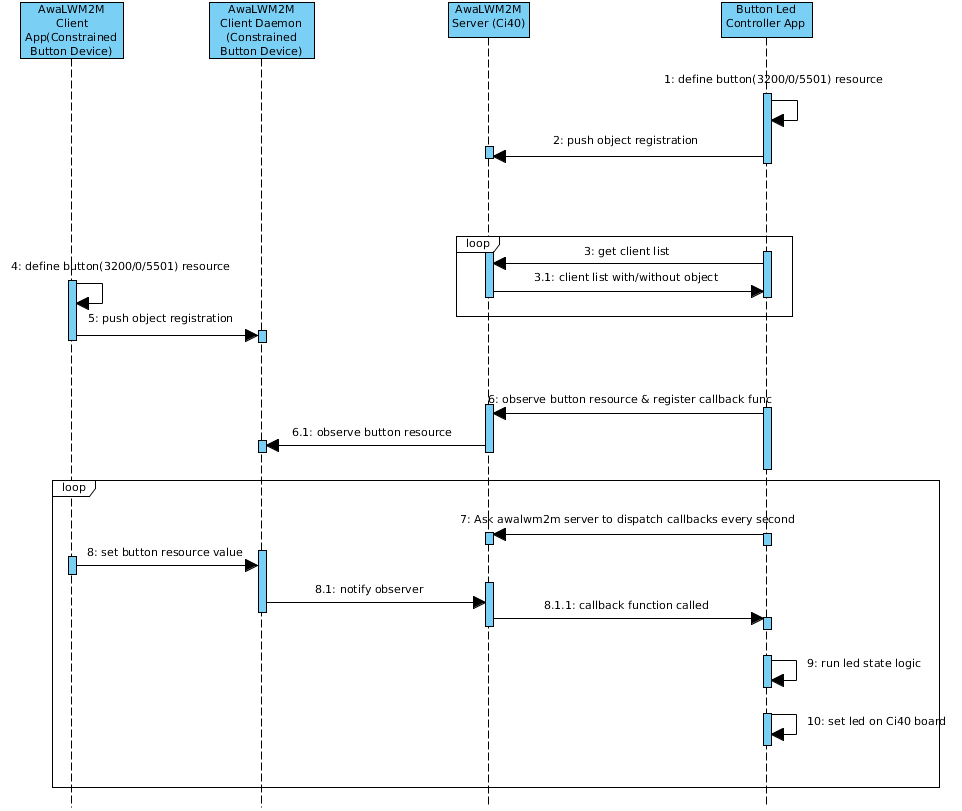

# Button-Led Controller application

## Overview
Button-Led controller application runs on Ci40 board. One MikroE board acts as awalwm2m client to simulate button. Controller application acts as awalwm2m server and observes any button presses on MikroE board, and whenever there is a change, controller gets a notification for the same, and change led state to ON or OFF present on Ci40 board.

| Object Name     | Object ID      | Resource Name | Resource ID |
| :----           | :--------------| :-------------| :-----------|
| "Digital Input" | 3200           | "Counter"      | 5501        |

## Prerequisites
Prior to running button-led controller application, make sure that:
- Awalwm2m server daemon(awa_serverd) is running.
- Awalwm2m bootstrap daemon(awa_bootstrapd) is running.

**NOTE:** Please do "ps" on console to see "specific" process is running or not.

## Application flow diagram


## API guide

Button-Led Controller documentation is available as a Doxygen presentation which is generated via the following process.

  1. Install [Doxygen ](http://www.stack.nl/~dimitri/doxygen/download.html): ```` sudo apt-get install doxygen````
  2. Generate the documentation:

        $ button-led-controller: mkdir build
        $ button-led-controller/build: cd build
        $ button-led-controller/build: cmake ../docs
        $ button-led-controller/build: make docs

The output can be found in the build/html directory and viewed by opening index.html with your web browser.

## Running Application on Ci40 board
Button-Led Controller Application is getting started as a daemon. Although we could also start it from the command line as :

*$ button_led_controller_appd*

Output looks something similar to this :
```
Button-Led Controller Application

------------------------


Establish server session for port:54321 and address:127.0.0.1

Server session established


Defining DigitalInput[3200] object on awalwm2m server

Waiting for constrained device 'ButtonDevice' to be up

Constrained device ButtonDevice registered

Successfully added observe operation for button object[3200/0/5501]


Received observe callback for button object[3200/0/5501] with value 1

Button state has changed

Turn ON led on Ci40 board

Received observe callback for button object[3200/0/5501] with value 0

Button state has changed

Turn OFF led on Ci40 board

Received observe callback for button object[3200/0/5501] with value 1

Button state has changed

Turn ON led on Ci40 board

Received observe callback for button object[3200/0/5501] with value 0

Button state has changed

Turn OFF led on Ci40 board
```
